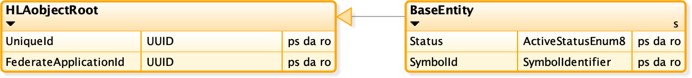

# NETN-BASE

|Version| Date| Dependencies|
|---|---|---|
|2.1|2023-03-18|RPR-Base|

The NATO Education and Training Network (NETN) Base Datatypes (BASE) Module provides standard definitions of datatypes and extends the RPR-BASE FOM Module.

This module is a base module for all other NETN-FOM modules. It specifies standard data types and structures and extends the RPR-BASE module. The specification is based on IEEE 1516 High Level Architecture (HLA) Object Model Template (OMT) and is primarily intended to support interoperability in a federated simulation (federation) based on HLA. An HLA-based Federation Object Model (FOM) is used to specify types of data and their encoding on the network. The NETN-BASE FOM module is available as an XML file for use in HLA-based federations.

## Object Classes

Note that inherited and dependency parameters are not explicitly listed for each interaction class below. Only parameters defined in this FOM Module are listed. 

### HLAobjectRoot

    
|Attribute|Datatype|Semantics|
|---|---|---|
|FederateApplicationId|UUID|Optional. The unique ID of the federate with the main responsibility for modelling.|
|UniqueId|UUID|Required. A unique identifier for the object. The Universally Unique Identifier (UUID) is either generated or defined as part of scenario initialization, e.g. using NETN-ORG MSDL data for defining specific platforms as equipment assigned to units.|
### BaseEntity

A base class of aggregate and discrete scenario domain participants. The BaseEntity class is characterized by being located at a particular location in space and independently movable, if capable of movement at all. It specifically excludes elements normally considered to be a component of another element. The BaseEntity class is intended to be a container for common attributes for entities of this type. Since it lacks sufficient class specific attributes that are required for simulation purposes, federates cannot publish objects of this class. Certain simulation management federates, e.g. viewers, may subscribe to this class. Simulation federates will normally subscribe to one of the subclasses, to gain the extra information required to properly simulate the entity.
    
|Attribute|Datatype|Semantics|
|---|---|---|
|Status|ActiveStatusEnum8|Required. Indicates if this entity currently is being simulated or not. E.g. an entity mounted or embarked on transports can be set to Inactive. During an inactive state, the attribute values may not reflect accurate or current values. All attributes must be updated to represent the current status of the object instance before setting the state to Active.|
|SymbolId|SymbolIdentifier|Optional. A symbol identifier is represented as a string formatted according to identified symbology standards.|
## Datatypes

Note that only datatypes defined in this FOM Module are listed below. Please refer to FOM Modules on which this module depends for other referenced datatypes.

### Overview
|Name|Semantics|
|---|---|
|ActiveStatusEnum8|A state which indicates the status of an object concerning its participation in the simulation. An object in an inactive state is not simulated and does not interact with other objects.|
|AggregateMissionEnum16|Representation of the general class or nature of activity related to a unit's mission. Enumerations are based on JC3IEDM action-event-category-code.|
|AltitudeMeterFloat64|Generic representation of altitude defined by the context of use, i.e. height Above Mean Sea Level, height Above Ground Level.|
|AltitudeTypeEnum8|The reference for altitude. AMSL = Above Mean Sea Level or AGL = Above Ground Level.|
|AreaVariantStruct|Description of an area relative to the earth's surface.|
|ArrayOfStringType|A generic representation of a set of strings.|
|ArrayOfText64|A set of names of max length 64 Unicode characters.|
|ArrayOfUuid|An array of Unique Identifiers expressed as UUIDs.|
|ArrayOfWorldLocationStruct|A polygonal chain (path) is expressed as a sequence of geocentric points.|
|Callsign|Identifier for a simulated entity. Callsigns should be unique in the context in which they are used but are not required to be globally unique.|
|CancellationReasonEnum32|Describes the reason for cancellation.|
|DamageStatusEnhancedEnum32|The damage status of an object.|
|DamageStatusEnum32|Damaged appearance|
|DirectionDegreesFloat32|The compass direction is measured clockwise relative to the true north. Calculate values outside the range [0, 360) as modulo 360.|
|EchelonEnum32|The echelon level of a unit.|
|EpochTimeSecInt64|The number of seconds since 1 Jan 1970 (wallclock time) or since the start of the simulation (logical time).|
|FederateName|The unique name of a federate participating in an HLA federation.|
|GeoLocationTypeEnum32|Specifies different ways to reference geographical locations.|
|GeodeticCircle|A geodetic point and radius specifying a circle on the surface of the earth WGS84 where the radius is a great circle distance on the surface.|
|GeodeticLocation|A geodetic point, specified by latitude and longitude, with unspecified altitude. WGS84|
|GeodeticPath|A sequence of geodetic locations defines a path where each segment is a great circle between locations.|
|GeodeticPoint|A geodetic point is specified by latitude, longitude and altitude.|
|GeodeticPolygon|A sequence of geodetic locations defines a geographical area bounded by a closed path where the first and last locations in the sequence are connected. Each point is a geodetic coordinate in WGS84 on the earth's surface, and each segment is a great circle between locations.|
|GeodeticQuadrangle|A latitude-longitude quadrangle is a region bounded by two meridians and two parallels.|
|HostilityStatusCodeEnum32|The value represents the perceived hostility status.|
|LatLongDegreesFloat64|Represents a measure of either latitude or longitude in decimal degrees of arc.|
|MassConcentrationFloat32|The concentration of a substance is measured as kg/m3.|
|MassDensityFloat32|The density of a substance is measured as kg/m3.|
|PathTypeEnum32|Specifies if a path is defined by waypoints or by reference to a path object in the federation.|
|PathVariantStruct|Defines a path, either as a polygonal chain of waypoints or a UUID that refers to a path object in the federation.|
|PercentFloat64|A generic measure of percentage (0-100).|
|PointTypeEnum32|Specifies if a point is defined by a location or by reference to a point object in the federation.|
|PointVariantStruct|Defines the point, either a Location or a UUID reference to a point object in the federation.|
|QuantityFloat32|A generic floating-point quantity.|
|QuantityFloat64|A generic floating-point quantity.|
|QuantityInt32|A generic discrete quantity.|
|SupplyStruct|Represents a single supply type and the quantity being offered or requested.|
|SupplyStructArray|A list of supply types and the number of each being offered or requested.|
|SymbolIdentifier|A symbol identifier is represented as a string. The symbol standard used is indicated using a URI notation (uri:xxxxxxxxxx). The following URI should be used for common symbology standards app6b, app6b, app6c, app6c, 2525b, 2525c, 2525d. If not provided the symbol standard used is undefined.|
|Text64|Text of max length 64 characters.|
|TimeSecInt32|A generic time interval in seconds.|
|UUID|4122, section 4.1.2 using 16 bytes. Also referred to as Variant 1 or RFC 4122/DCE 1.1 UUIDs. For example, 00112233-4455-8877-6699-aabbccddeeff is encoded as the bytes 00 11 22 33 44 55 88 77 66 99 aa bb cc dd ee ff.|
|WorldLocationStruct|The location of an object in the world coordinate system, as specified in IEEE Std 1278.1-1995 section 1.3.2.|
        
        
### Simple Datatypes
|Name|Units|Semantics|
|---|---|---|
|AltitudeMeterFloat64|Meter|Generic representation of altitude defined by the context of use, i.e. height Above Mean Sea Level, height Above Ground Level.|
|DirectionDegreesFloat32|Degree|The compass direction is measured clockwise relative to the true north. Calculate values outside the range [0, 360) as modulo 360.|
|EpochTimeSecInt64|Second|The number of seconds since 1 Jan 1970 (wallclock time) or since the start of the simulation (logical time).|
|LatLongDegreesFloat64|Degree|Represents a measure of either latitude or longitude in decimal degrees of arc.|
|MassConcentrationFloat32|kg/m3|The concentration of a substance is measured as kg/m3.|
|MassDensityFloat32|kg/m3|The density of a substance is measured as kg/m3.|
|PercentFloat64|Percent|A generic measure of percentage (0-100).|
|QuantityFloat32|NA|A generic floating-point quantity.|
|QuantityFloat64|NA|A generic floating-point quantity.|
|QuantityInt32|NA|A generic discrete quantity.|
|TimeSecInt32|Second|A generic time interval in seconds.|
        
### Enumerated Datatypes
|Name|Representation|Semantics|
|---|---|---|
|ActiveStatusEnum8|HLAoctet|A state which indicates the status of an object concerning its participation in the simulation. An object in an inactive state is not simulated and does not interact with other objects.|
|AggregateMissionEnum16|HLAinteger16BE|Representation of the general class or nature of activity related to a unit's mission. Enumerations are based on JC3IEDM action-event-category-code.|
|AltitudeTypeEnum8|HLAoctet|The reference for altitude. AMSL = Above Mean Sea Level or AGL = Above Ground Level.|
|CancellationReasonEnum32|HLAinteger32BE|Describes the reason for cancellation.|
|DamageStatusEnhancedEnum32|HLAinteger32BE|The damage status of an object.|
|DamageStatusEnum32|RPRunsignedInteger32BE|Damaged appearance|
|EchelonEnum32|HLAinteger32BE|The echelon level of a unit.|
|GeoLocationTypeEnum32|HLAinteger32BE|Specifies different ways to reference geographical locations.|
|HostilityStatusCodeEnum32|HLAinteger32BE|The value represents the perceived hostility status.|
|PathTypeEnum32|HLAinteger32BE|Specifies if a path is defined by waypoints or by reference to a path object in the federation.|
|PointTypeEnum32|HLAinteger32BE|Specifies if a point is defined by a location or by reference to a point object in the federation.|
        
### Array Datatypes
|Name|Element Datatype|Semantics|
|---|---|---|
|ArrayOfStringType|HLAunicodeString|A generic representation of a set of strings.|
|ArrayOfText64|Text64|A set of names of max length 64 Unicode characters.|
|ArrayOfUuid|UUID|An array of Unique Identifiers expressed as UUIDs.|
|ArrayOfWorldLocationStruct|WorldLocationStruct|A polygonal chain (path) is expressed as a sequence of geocentric points.|
|Callsign|HLAunicodeChar|Identifier for a simulated entity. Callsigns should be unique in the context in which they are used but are not required to be globally unique.|
|FederateName|HLAunicodeChar|The unique name of a federate participating in an HLA federation.|
|GeodeticPath|GeodeticLocation|A sequence of geodetic locations defines a path where each segment is a great circle between locations.|
|GeodeticPolygon|GeodeticLocation|A sequence of geodetic locations defines a geographical area bounded by a closed path where the first and last locations in the sequence are connected. Each point is a geodetic coordinate in WGS84 on the earth's surface, and each segment is a great circle between locations.|
|SupplyStructArray|SupplyStruct|A list of supply types and the number of each being offered or requested.|
|SymbolIdentifier|HLAunicodeChar|A symbol identifier is represented as a string. The symbol standard used is indicated using a URI notation (uri:xxxxxxxxxx). The following URI should be used for common symbology standards app6b, app6b, app6c, app6c, 2525b, 2525c, 2525d. If not provided the symbol standard used is undefined.|
|Text64|HLAunicodeChar|Text of max length 64 characters.|
|UUID|HLAbyte|4122, section 4.1.2 using 16 bytes. Also referred to as Variant 1 or RFC 4122/DCE 1.1 UUIDs. For example, 00112233-4455-8877-6699-aabbccddeeff is encoded as the bytes 00 11 22 33 44 55 88 77 66 99 aa bb cc dd ee ff.|
        
### Fixed Record Datatypes
|Name|Fields|Semantics|
|---|---|---|
|GeodeticCircle|CenterPoint, Radius|A geodetic point and radius specifying a circle on the surface of the earth WGS84 where the radius is a great circle distance on the surface.|
|GeodeticLocation|Latitude, Longitude|A geodetic point, specified by latitude and longitude, with unspecified altitude. WGS84|
|GeodeticPoint|Latitude, Longitude, Altitude|A geodetic point is specified by latitude, longitude and altitude.|
|GeodeticQuadrangle|Point1, Point2|A latitude-longitude quadrangle is a region bounded by two meridians and two parallels.|
|SupplyStruct|SupplyType, Quantity|Represents a single supply type and the quantity being offered or requested.|
|WorldLocationStruct|X, Y, Z|The location of an object in the world coordinate system, as specified in IEEE Std 1278.1-1995 section 1.3.2.|
        
### Variant Record Datatypes
|Name|Discriminant (Datatype)|Alternatives|Semantics|
|---|---|---|---|
|AreaVariantStruct|AreaType (GeoLocationTypeEnum32)|GeodeticPolygon, GeodeticCircle, GeodeticQuadrangle|Description of an area relative to the earth's surface.|
|PathVariantStruct|PathType (PathTypeEnum32)|Waypoints, UUID|Defines a path, either as a polygonal chain of waypoints or a UUID that refers to a path object in the federation.|
|PointVariantStruct|PointType (PointTypeEnum32)|Location, UUID|Defines the point, either a Location or a UUID reference to a point object in the federation.|
    